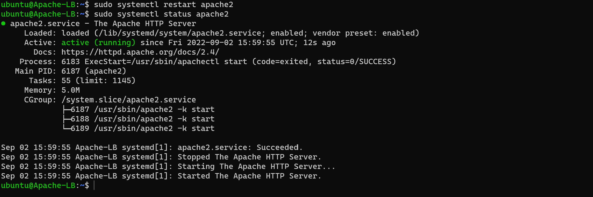
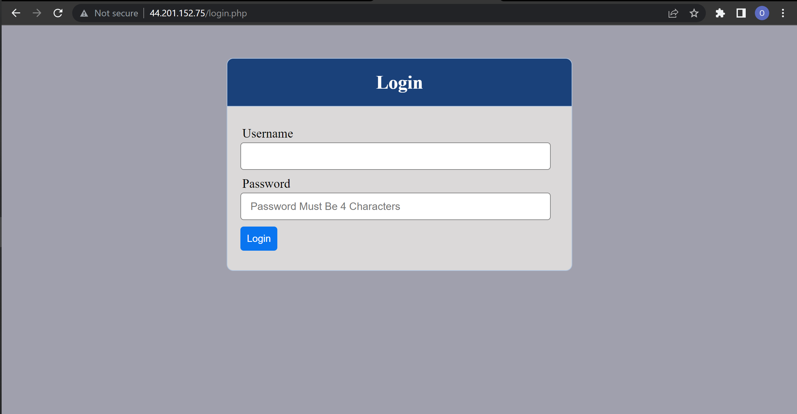
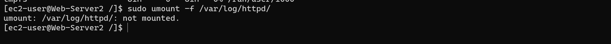
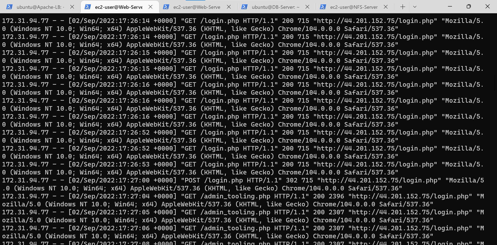
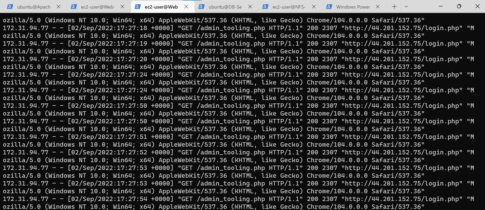
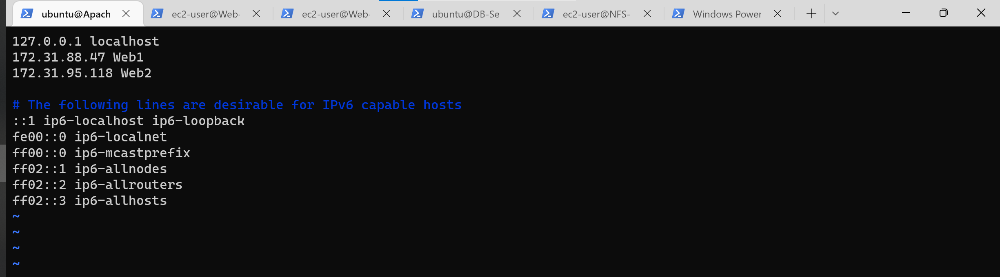

# Configure Apache As A Load Balancer

Create an Ubuntu Server 20.04 EC2 instance and name it Project-8-apache-lb.


Open TCP port 80 on Project-8-apache-lb by creating an Inbound Rule in Security Group.


On the LB instance - Update the repo, install Apache server and the xml package as well as enable some required apache modules.

```bash
sudo apt update -y
sudo apt install Apache2 -y
sudo apt-get install libxml2-dev -y

# Required Modules
sudo a2enmod rewrite
sudo a2enmod proxy
sudo a2enmod proxy_balancer
sudo a2enmod proxy_http
sudo a2enmod headers
sudo a2enmod lbmethod_bytraffic
```


Restart apache2 service

```bash
sudo systemctl restart apache2
```


Configure load balancing configure it to point traffic coming to LB to both Web Servers

Let's edit the Apache configuration file to register the two web servers

```bash
sudo vi /etc/apache2/sites-available/000-default.conf
```

Add the following line of codes within the which includes the private ip for both web servers```<vitualhist tags>```

```bash

<Proxy "balancer://mycluster">
               BalancerMember http://<WebServer1-Private-IP-Address>:80 loadfactor=5 timeout=1
               BalancerMember http://<WebServer2-Private-IP-Address>:80 loadfactor=5 timeout=1
               ProxySet lbmethod=bytraffic
               # ProxySet lbmethod=byrequests
</Proxy>


        ProxyPreserveHost On
        ProxyPass / balancer://mycluster/
        ProxyPassReverse / balancer://mycluster/
```


Restart the apache service to register the update

```bash
sudo systemctl restart apache2
```



> ```bytraffic``` balancing method will distribute incoming load between the Web Servers according to current traffic load. We can control in which proportion the traffic must be distributed by ```loadfactor``` parameter.

Verify the LB Server (via public ip) is serving the tooling website in the browser.



Verify the log directory of both web servers are not mounted to the NFS server.

```bash
sudo umount -f /var/log/httpd/
```



To see traffic distrubtion (Load balancing) in action - open log file for both web servers and refresh the LB-server serveral times.

```bash
sudo tail -f /var/log/httpd/access_log
```

``` web server 1 ```



``` web server 2 ```



> From the Logs, you can see both Web Servers are receiving the same web traffic. This is because the ``` loadfactor ``` was set to the value ``` 5 ```

Optional Step – Configure Local DNS Names Resolution in the LB - Server

```bash
sudo vi /etc/hosts
```

Add the private ip address for the two web servers

172.31.88.47 Web1
172.31.95.118 Web2



Update this changes in the configuration file of the apache server on the LB instance.

```bash
sudo vi /etc/apache2/sites-available/000-default.conf
```


