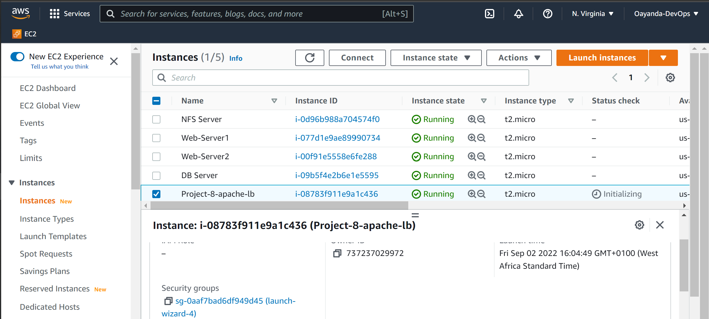
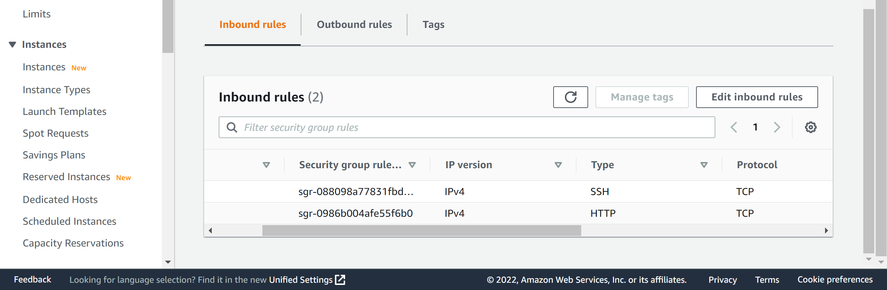
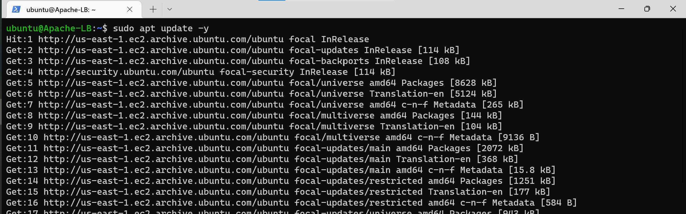
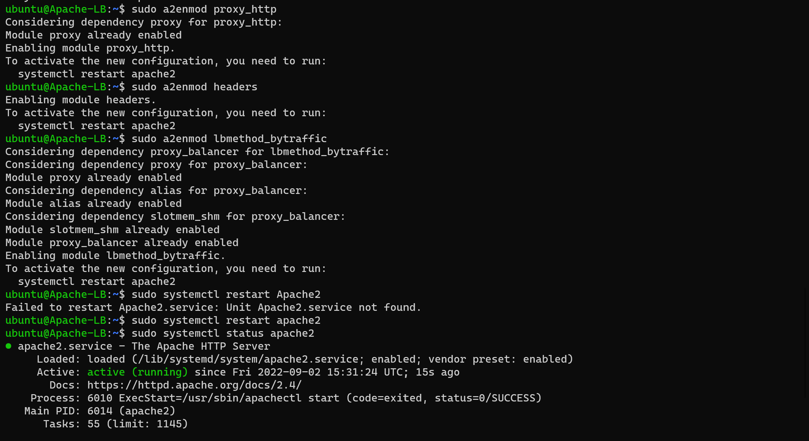
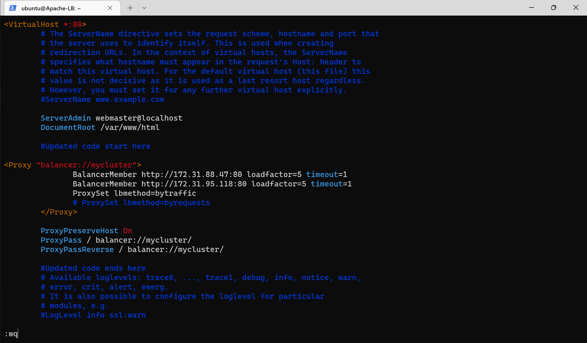

# Configure Apache As A Load Balancer

Create an Ubuntu Server 20.04 EC2 instance and name it Project-8-apache-lb.



Open TCP port 80 on Project-8-apache-lb by creating an Inbound Rule in Security Group.



On the LB instance - Update the repo, install Apache server and the xml package as well as enable some required apache modules.

```bash
sudo apt update -y
sudo apt install Apache2 -y
sudo apt-get install libxml2-dev -y

# Required Modules
sudo a2enmod rewrite
sudo a2enmod proxy
sudo a2enmod proxy_balancer
sudo a2enmod proxy_http
sudo a2enmod headers
sudo a2enmod lbmethod_bytraffic
```


Restart apache2 service

```bash
sudo systemctl restart apache2
```



Configure load balancing configure it to point traffic coming to LB to both Web Servers

Let's edit the Apache configuration file to register the two web servers

```bash
sudo vi /etc/apache2/sites-available/000-default.conf
```

Add the following line of codes within the which includes the private ip for both web servers```<vitualhist tags>```

```bash

<Proxy "balancer://mycluster">
               BalancerMember http://<WebServer1-Private-IP-Address>:80 loadfactor=5 timeout=1
               BalancerMember http://<WebServer2-Private-IP-Address>:80 loadfactor=5 timeout=1
               ProxySet lbmethod=bytraffic
               # ProxySet lbmethod=byrequests
</Proxy>


        ProxyPreserveHost On
        ProxyPass / balancer://mycluster/
        ProxyPassReverse / balancer://mycluster/
```


        