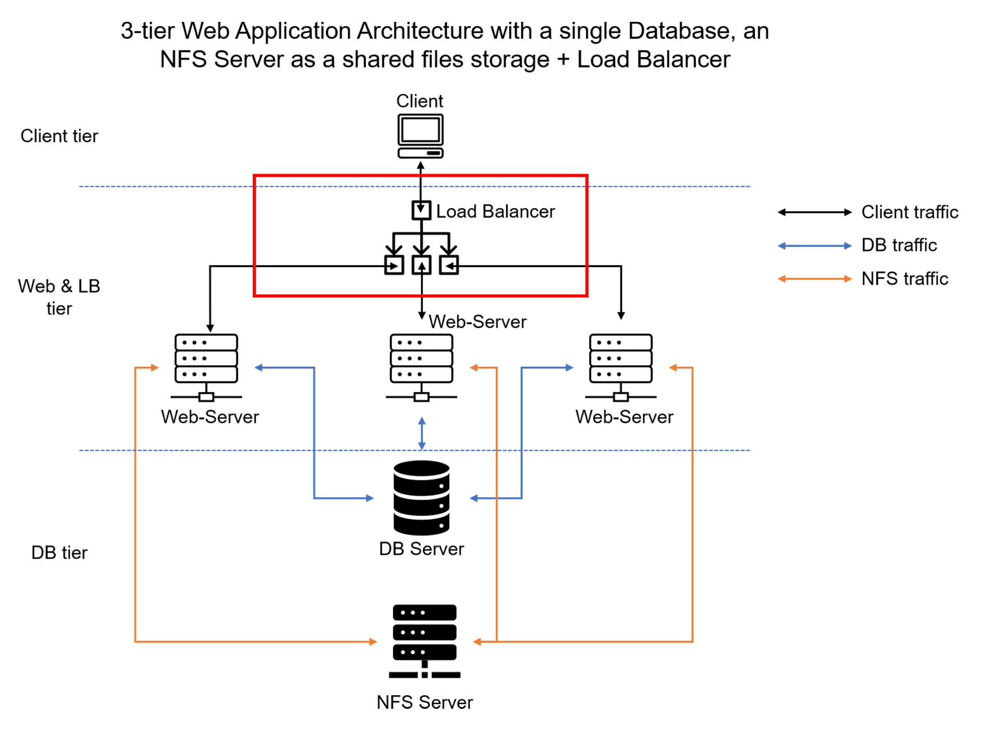

# LOAD-BALANCER-SOLUTION-WITH-APACHE

In this project, I have deploy and configure an Apache Load Balancer for Tooling Website solution on a separate Ubuntu EC2 intance. Additionally, I have made sure that users can be served by Web servers through the Load Balancer.

